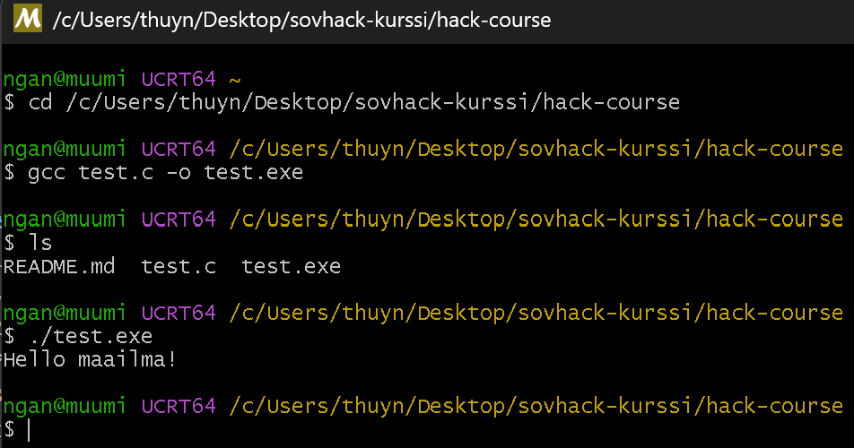

# h0 Compile and Analyze
Ngan Tran 21.8.2026

# Tiivistelmä
Kiireen keskellä en ole ennen ekaa oppituntia ehtinyt tehdä dual boottia omalle koneelle. Sen takia tein ekat läksyt nyt Windows 11 avulla. 

Vaikka tehtävä onnistui Windowsilla, niin koen, että parasta on loppujen lopuksi asentaa Linux koneelle koko kurssia varten.

Minulla meni tehtävään noin 1h15min

# Työkalut
- VSCode
    - C/C++ lisäosa Microsoftilta
- MSYS2
    - gcc asennettuna MSYS2 kautta

# Ympäristön ja työkalujen asentaminen
1. Lähestyin tehtävää etsimällä Hello World koodipätkää Googlesta ja löysin sellaisen sivulta https://www.geeksforgeeks.org/c/c-hello-world-program/.
2. Tein Github repon ilman READMetä. Kloonasin sen omalle konelle ja loin **test.c** nimisen tiedoston ja vein sinne Hello World koodipätkän.
3. Jäin heti jumiin löytää ohjeita asentaaa gcc tai g++ Windowsille. Koska tekoälyn käyttö kiellettiin ensimmäiset 10min, en osannut itse päättää kumpi on parempi ladata. Epäröin erilaisia löytämäni ohjeita ja en halunnut vahingossa ladata haittaohjelmia.
4. Kun tekoälyä sai käyttää päädyin sen kehotusten mukaisesti lataamaan **gcc:n työkalun MSYS2 kautta**. MSYS2 tarjoaa Unix-ympäristön ja käännöstyökalut ilman, että Linuxia tarvitsee asentaa koneelle. https://www.msys2.org/

# MSYS2 UCRT64 ja gcc:n lataus
5. Lisäsin Windows pathiin
`C:\msys64\ucrt64\bin`
6. Kun MSYS2 on asennettu, avasin uuden MSYS2 UCRT64 komentorivin.
7. Komentorivilta latasin gcc kääntäjän seuraavalla komennolla
`pacman -S mingw-w64-ucrt-x86_64-gcc`
8. Käynnistin terminaalin uudelleen ja tarkistin onnistuiko lataus
`gcc --version`

# Varsinainen toteutus
9. Navigoin projektiini komennolla
`cd /c/Users/thuyn/Desktop/sovhack-kurssi/hack-course`
10. Käänsin ohjelman binääriksi .exe tiedostoksi
`gcc test.c -o test.exe`
11. Tarkistin, että uusi .exe tiedosto ilmestyi komennolla
`ls`
12. Suoritin ohjelman
`./test.exe`

# Vastaus

# Virheet ja oppimiset
- **VSCoden git bash ja lataamani MSYS2 UCRT64 ovat kaksi täysin eri ympäristöä.** Koitin aluksi ajaa kääntäjän komennot VSCoden Git Bashilta, koska luulin, että MSYS2 asentaa gcc:n myös sinne. Tappelin tämän kanssa turhaan.
- Nano on komentorivillä toimiva kätevä tekstieditori. 
- a.exe on Windowsin defaultti output
- foo.c on source code