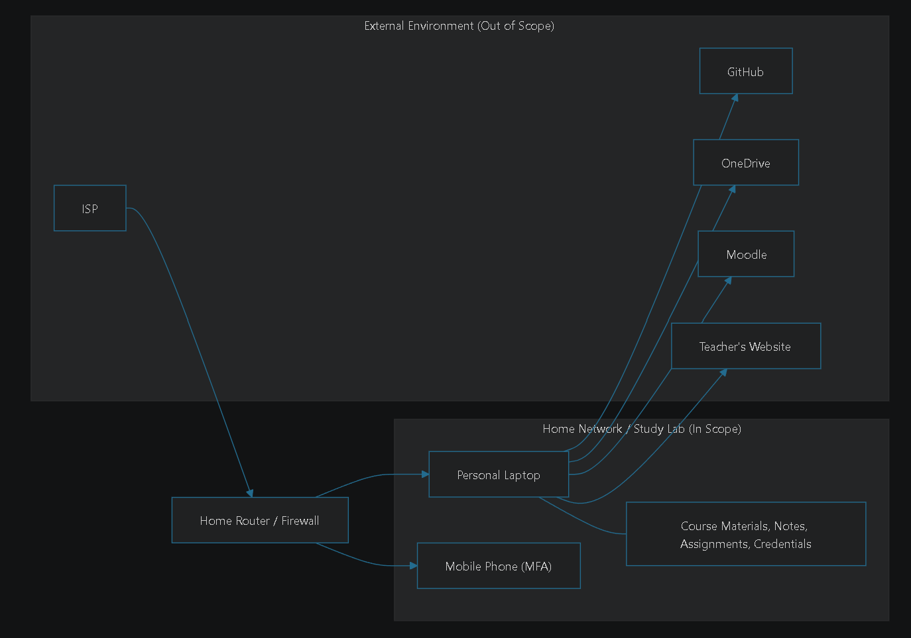
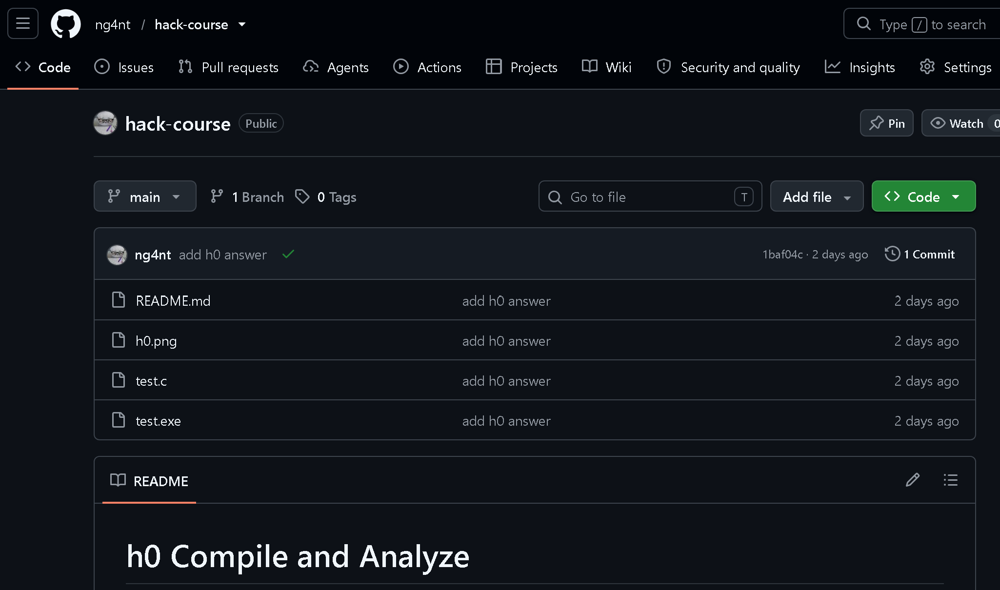
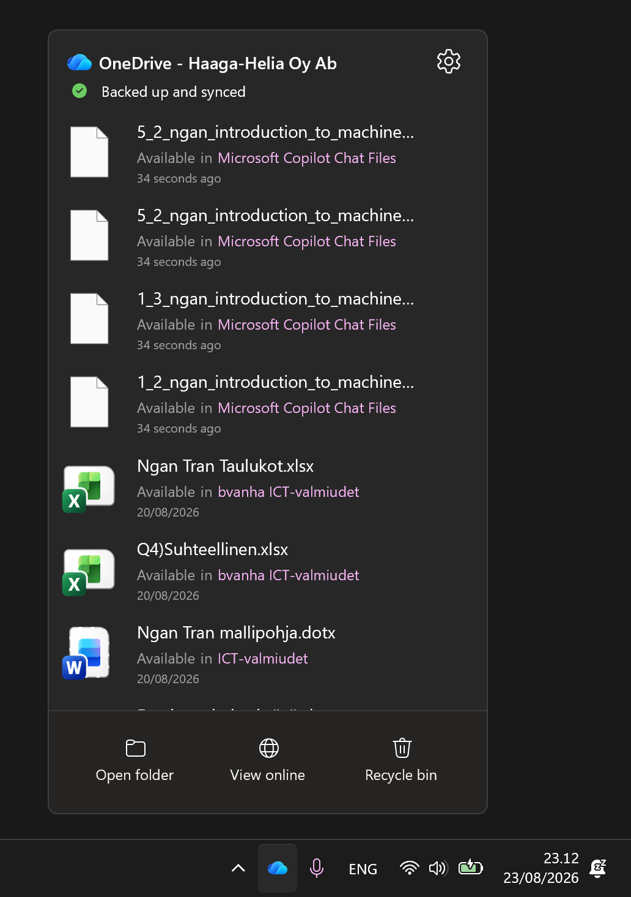
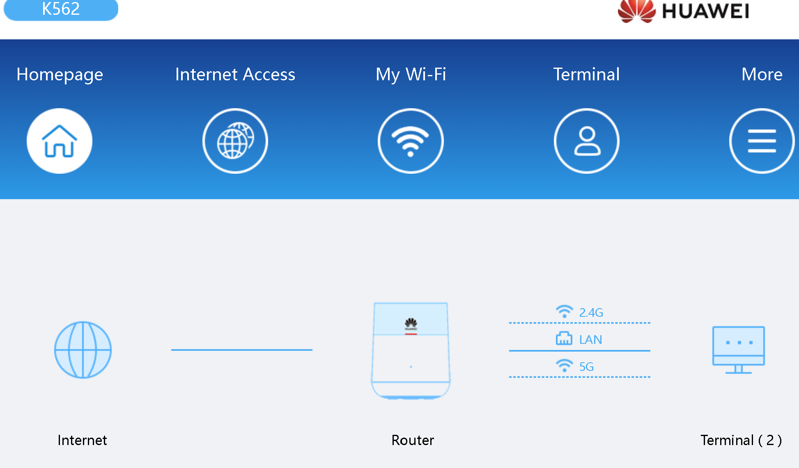

# Freedom of Action, Control, and Risk Mitigation

23.8.2026

# a1) What is included in the scope

My ISMS (Information Security Management System) scope covers my home study environment used for course exercises and learning activities. The scope includes the devices, network infrastructure, services, and information that I manage and use for studying.

- Personal laptop used for coursework and assignments
- Mobile phone used for multi-factor authentication (MFA)
- Home router and Wi‑Fi network
- GitHub repositories used for coursework and version control
- OneDrive for file storage and backup
- Course materials, personal notes, and assignment files
- Study-related user accounts, passwords, and authentication credentials

# a2) What is excluded from the scope and why
The following items are excluded from the scope:

- Work laptop and work phone because they are managed by my employer and follow separate security policies and controls.
- The ISP network outside my home router, because I cannot administer or control it.
- Microsoft and GitHub internal infrastructure, because I only use their services and do not manage the underlying systems.

These exclusions are based on ownership, administrative control and relevance to the study environment. The ISMS only covers assets and processes that I can directly manage and influence.

# a3) Key interfaces and boundaries

## Cloud services
- **GitHub** is used for storing source code and coursework.
- **OneDrive** is used for file sync, backup and additional storage.
- **Moodle** is used for accessing course materials.
- **Teacher's Hugo based web pages** are used for submitting coursework.

These services are outside the direct scope of the ISMS but are important interfaces that must be accessed securely using authentication.

## Remote Connections
- SSH connections are used to access GitHub repositories securely for version control and coursework management.

## Network boundary
- The home router and its firewall form the boundary between the internal home network and the public internet.

## Suppliers and Service Providers
- Internet Service Provider (ISP) provides internet connectivity.
- Microsoft provides OneDrive and account services.
- GitHub provides repository hosting and version control services.
- Device vendor Lenovo offers hardware and software updates.

These providers are external to the ISMS scope but are important dependencies for the study environment.

## 

# Evidence Addendum
## Device Inventory
- Lenovo Legion Slim 5 14
- iPhone 13

## GitHub repo

Screenshot of the GitHub repository used for coursework.

## OneDrive

Screenshot showing file synchronization and backup settings.

## Home Router and Wi-Fi

Screenshot of the router administration page showing the router status, Wi‑Fi configuration and connected devices.

# b) Linking the Assignment to ISO 27001

| Interested Party | Need / Requirement | ISO 27001 Reference | Evidence |
|---|---|---|---|
| Me | My study files must be available and not lost. | Operation | OneDrive backups and saved coursework files. |
| Haaga-Helia | Coursework must be submitted honestly and securely. | Operation | Assignment submissions through Moodle and the course website. |
| GitHub | My account should be used securely. | Support | Strong password and MFA enabled on GitHub. |
| Internet Service Provider (ISP) | The internet connection should be used according to the service agreement. | Context | Normal and lawful use of the home network. |

Copilot has been used to help draw diagrams with Mermaid and fix language grammar