# h5 h5 Binääri tässä, missä koodit?
2.9.2026

# main.cpp
1. Compiled the program with debugging symbols (-g) and attempted to start GDB. Discovered that GDB was not installed because the terminal returned command not found.
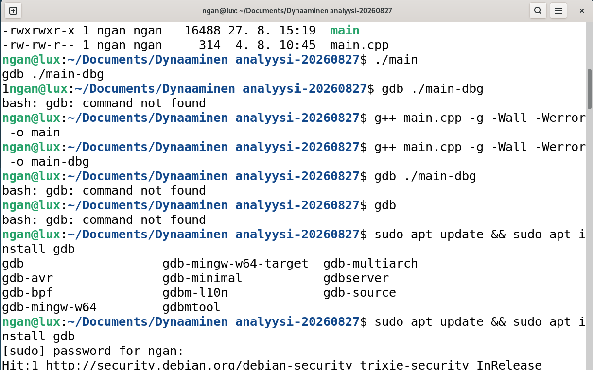

2. Updated package repositories and installed GDB along with the required dependencies to prepare the debugging environment.
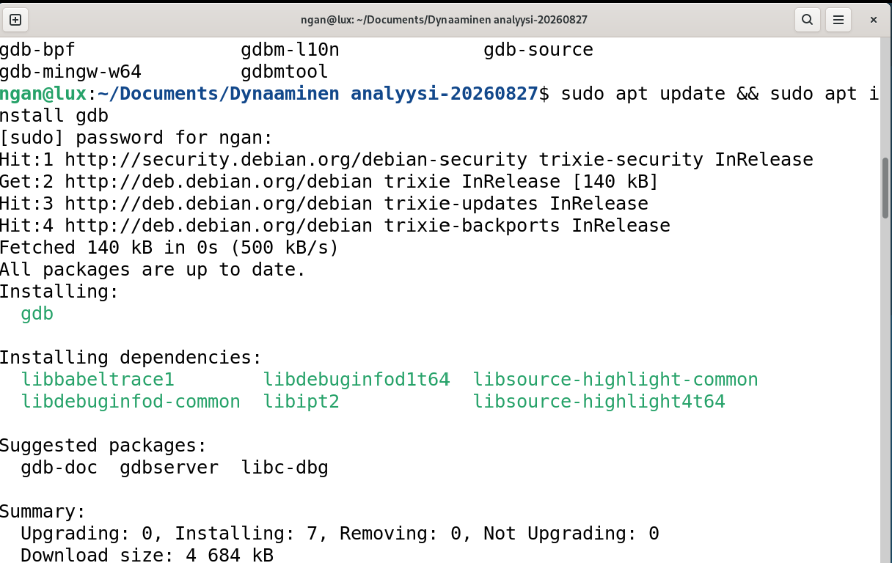

3. Launched GDB, loaded the debug version of the program, and set breakpoints to pause execution at key locations in the source code for further analysis.
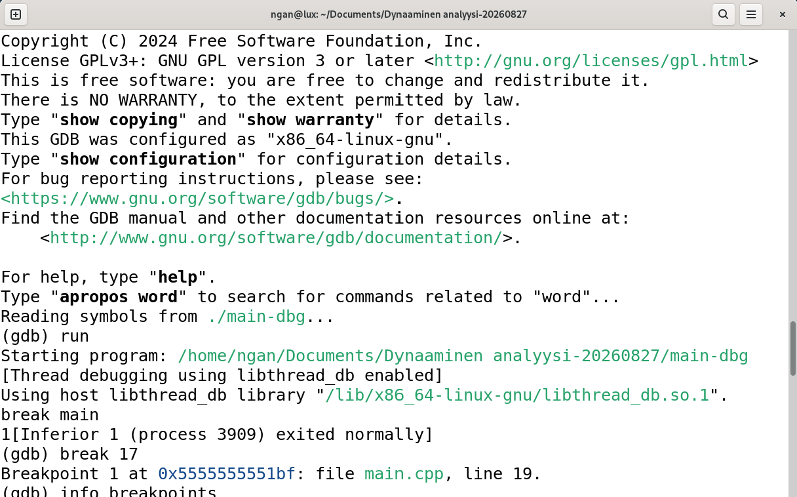

4. Set breakpoints in the factorial() function and used info breakpoints to verify their locations before starting program execution. Selected a factorial function as the test program because it contains a loop and variable updates.
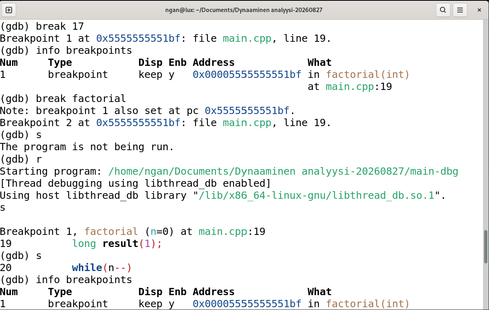

5. Started the program in GDB, entered the factorial() function, and used the display command to automatically monitor the values of n and result during execution.
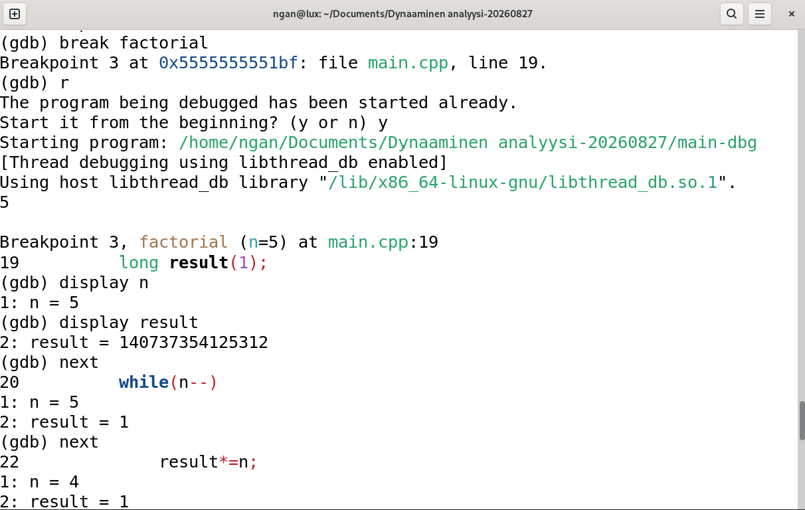

6. Stepped through the loop with the next command and observed how n decreased while result was updated after each multiplication. This confirmed that the factorial calculation was working as expected.
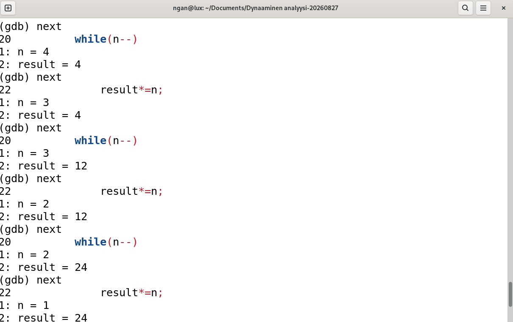

7. Continued stepping through the remaining iterations until the loop reached its termination condition (n = 0). Observed the final changes in the variables to understand the complete execution flow.
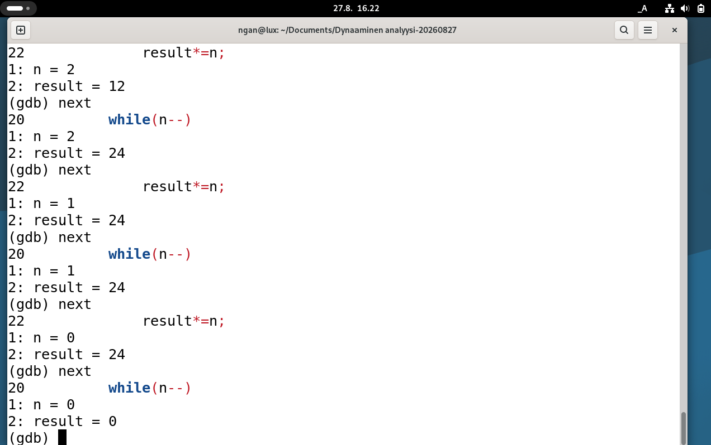

8. Used the print command to inspect the final value of result and confirm the program state after execution. This demonstrated how GDB can be used to examine variables and verify program behavior.
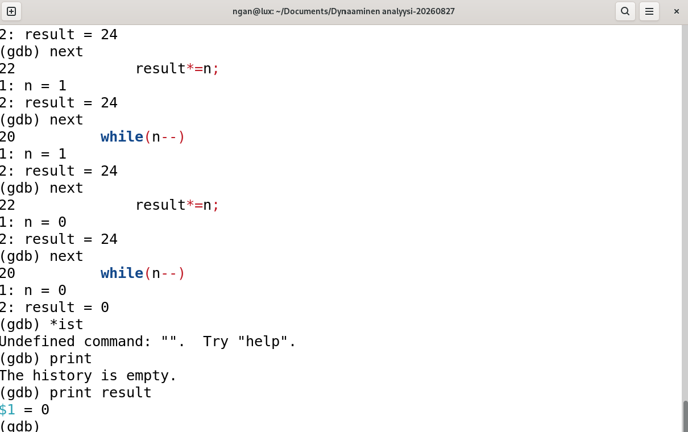

Results: The debugging process revealed a logic error in the factorial() function, where the loop multiplies by a decremented value of n, resulting in an incorrect factorial calculation.

# Lab0.zip

The program was compiled and loaded into GDB. A breakpoint was placed in buggy_function() so execution could be paused and examined before entering the loop.
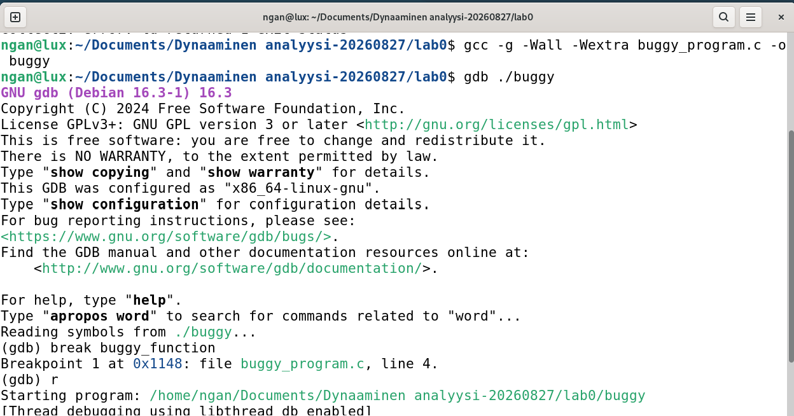
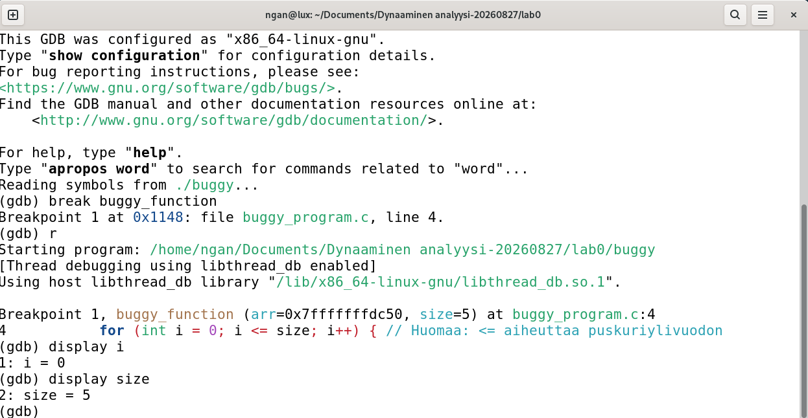
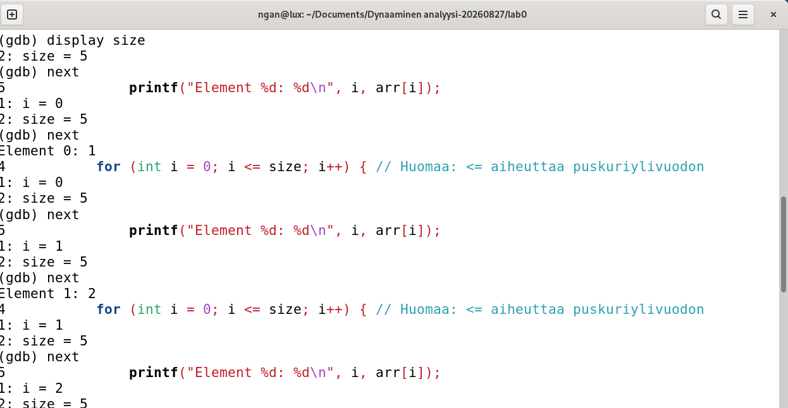
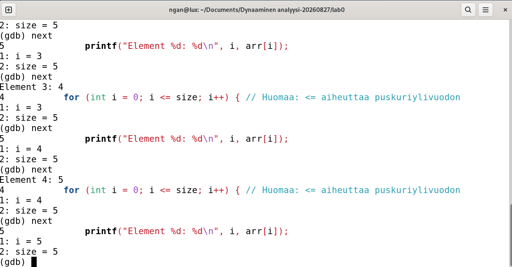