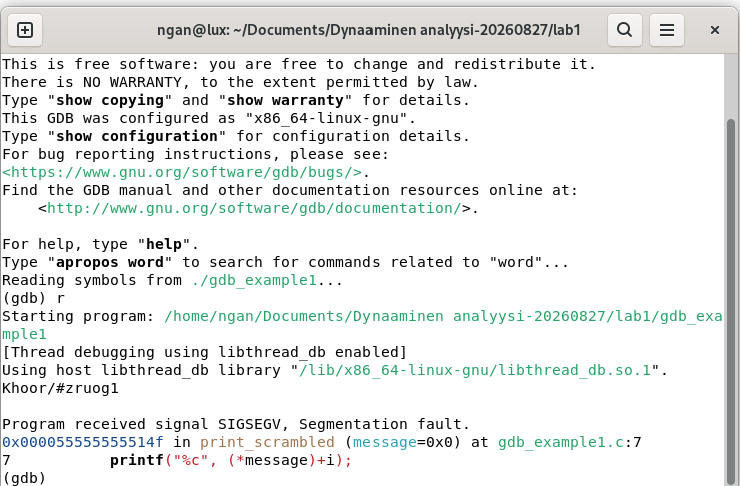
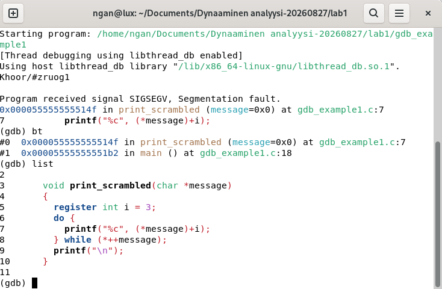
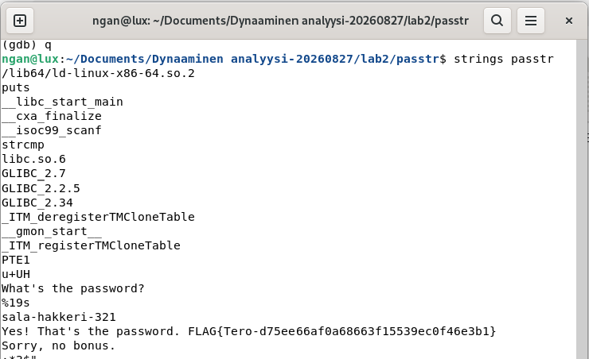
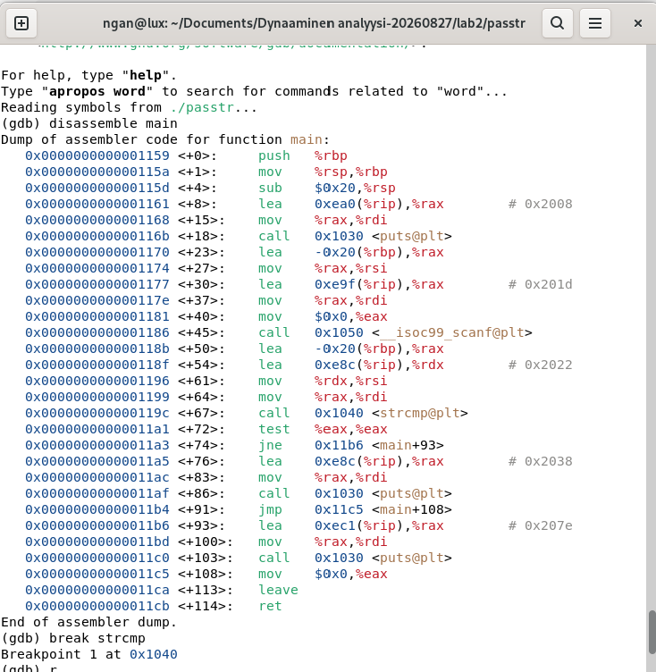
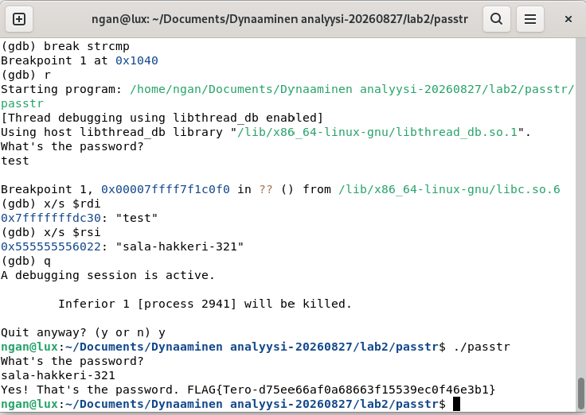
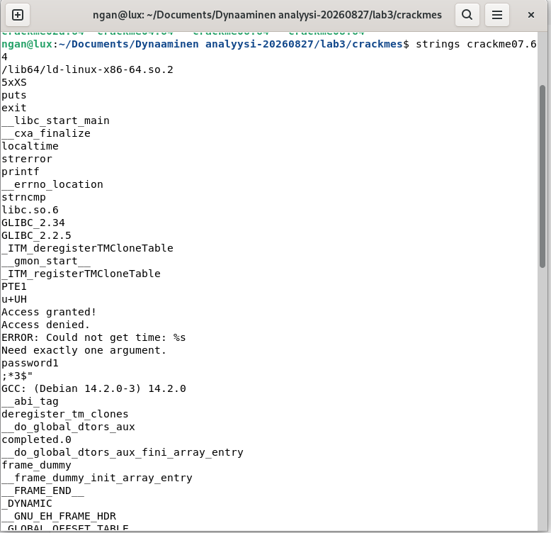
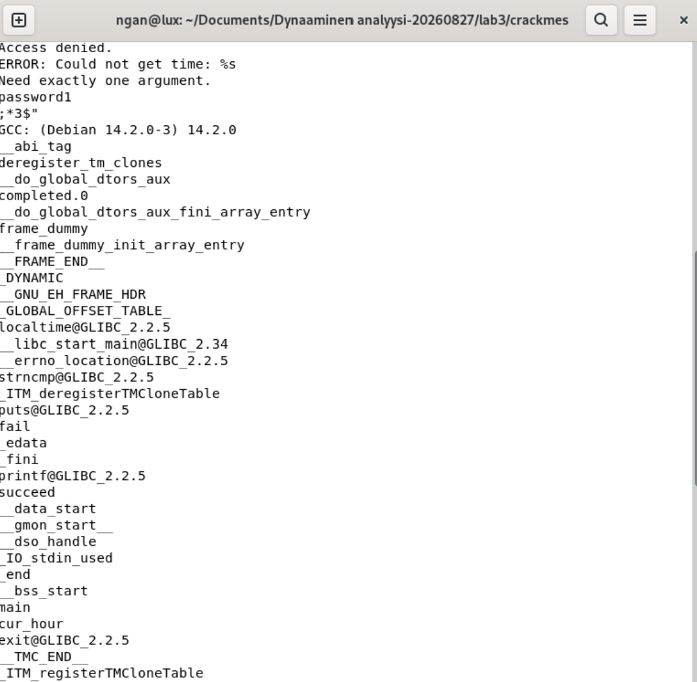
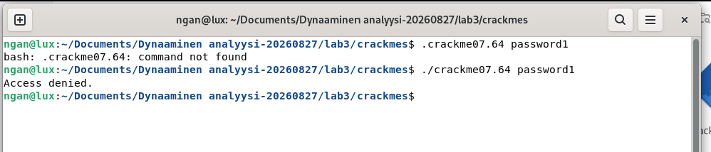
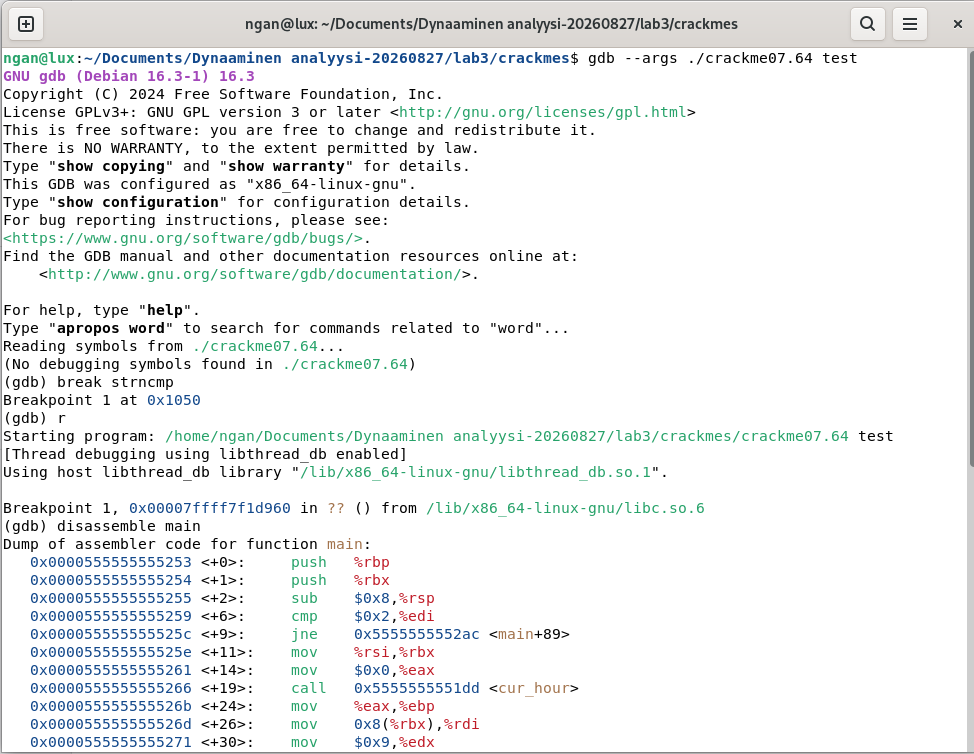
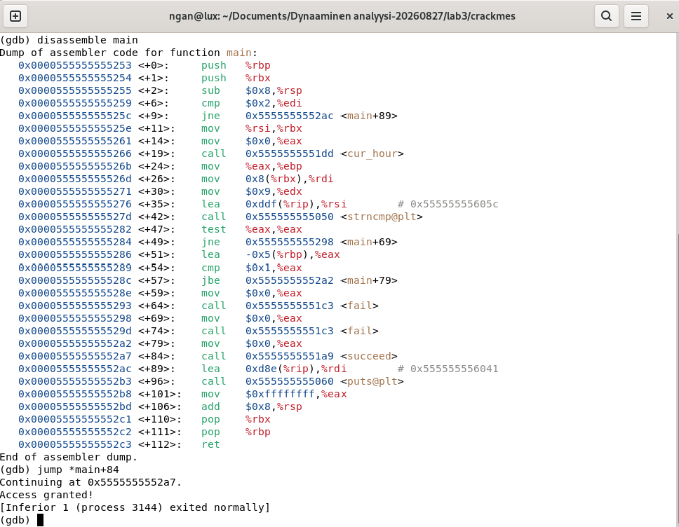

# h5 h5 Binääri tässä, missä koodit?
2.9.2026

# main.cpp
1. Compiled the program with debugging symbols (-g) and attempted to start GDB. Discovered that GDB was not installed because the terminal returned command not found. Caused by Linux distributions like Debian do not always include debugging tools by default.

2. Updated package repositories and installed GDB along with the required dependencies to prepare the debugging environment.

3. Launched GDB, loaded the debug version of the program, and set breakpoints to pause execution at key locations in the source code for further analysis.

4. Set breakpoints in the factorial() function and used info breakpoints to verify their locations before starting program execution. Selected a factorial function as the test program because it contains a loop and variable updates.

5. Started the program in GDB, entered the factorial() function, and used the display command to automatically monitor the values of n and result during execution.

6. Stepped through the loop with the next command and observed how n decreased while result was updated after each multiplication. This confirmed that the factorial calculation was working as expected.

7. Continued stepping through the remaining iterations until the loop reached its termination condition (n = 0). Observed the final changes in the variables to understand the complete execution flow.

8. Used the print command to inspect the final value of result and confirm the program state after execution. This demonstrated how GDB can be used to examine variables and verify program behavior.

Results: The debugging process revealed a logic error in the factorial() function, where the loop multiplies by a decremented value of n, resulting in an incorrect factorial calculation.

-----

# Lab0.zip
The program was compiled and loaded into GDB. A breakpoint was placed in buggy_function() so execution could be paused and examined before entering the loop.
1. Compiled the program with debugging symbols (-g) and started GDB.
Also placed a breakpoint in buggy_function() so program execution could be paused right as the function begins.

2. Started the program in GDB using the run command. Once execution hit the breakpoint at buggy_function(), configured GDB with display i and display size to automatically monitor the loop index counter (i) and array size (size = 5) throughout execution.

3. Stepped through the loop line-by-line using the next command. Watched the counter i increase with each step, printing out stored list items from item 0 up to item 3 (arr[i] represents the list item at position i).

4. Continued stepping through the loop until the counter i reached 5. Because the code checked i <= size (5 <= 5), the loop tried to read position 5. Since a list of 5 items only uses positions 0, 1, 2, 3, and 4, reading position 5 went past the end of the list memory (an off-by-one bug).

-----

# Lab1.zip
1. Loaded the compiled binary `./gdb_example1` into GDB and executed it using the `r` (run) command. The program printed error `(Khoor/#zruogl)` before crashing with `Program received signal SIGSEGV, Segmentation fault`.

2. Find out where it crashed by using backtrace command and viewing source code with `bt` and viewing source code with `list`

This reveals to us that the crash happened at line 7 inside print_scrambled() because the text variable message was set to 0x0 (a NULL empty memory address). Attempting to read a character from an empty NULL memory address caused the Segmentation Fault crash.

3. To fix the bug, we open the file in a text editor (like nano gdb_example1.c) and add a safety check before line 5 to make sure message is not NULL.

`
void print_scrambled(char *message)
{
    if (message == NULL) return;
    
    register int i = 3;
    do {
        printf("%c", (*message)+i);
    } while (*++message);
    printf("\n");
}
`
Then re-compile with make or gcc -g gdb_example1.c -o gdb_example1 and run it again.

-----
# Lab2.zip
1. Ran `strings passtr` to inspect human-readable text inside the un-optimized binary, revealing the plaintext password `sala-hakkeri-321`.

2. Loaded passtr into GDB and disassembled main `disassemble main`. Located the string comparison call `strcmp` at `*main+67` and placed a breakpoint using break `*main+67`.
3. Executed `r` and entered dummy input `test`. When GDB hit the breakpoint, inspected registers using `x/s $rdi` (user input) and `x/s $rsi` (expected password), confirming sala-hakkeri-321 in memory.

Pictures of the process and confirm password is correct

-----
# Lab3.zip (crackme07.64)
### Method with strings command:
We can see that the output of strings prints out `password1` but also `localtime` (retrivies local system datetime) and `localtime@GLIBC_2.2.5` (checks time). 

This means the program imports localtime, references cur_hour and outputs an error about getting the time. This means that the binary checks the current time of day as part of its password generation or comparison logic.

Let's read the logic from crackme07.c with command `cat crackme07.c` We can see that the program reads the system datetime and modifies `password1` bwith the number of the current hour.

For example if the system clock is 13:00, the password is `password113`, but we cannot be 100% sure

It's the best to crack the password using GDB method

### Method with GDP
1. Loaded the binary into GDB using `gdb --args ./crackme07.64 test`.
2. Disassembled the `main` function (`disassemble main`). The disassembly showed that user input is compared against `"password1"` at `<+42>` using `strncmp`.
3. Further analysis of lines `<+19>` through `<+57>` revealed that the program calls `<cur_hour>` to retrieve the current hour from the system clock and checks if the hour is 5 or 6 AM before granting access.
4. Bypassed the time check in GDB by placing a breakpoint on `strncmp` (`break strncmp`), running the process (`run`), and jumping directly to the `<succeed>` call at `<+84>` using `jump *main+84`. The program executed `<succeed>` and printed `Access granted!`.

