# h6 Onkohan tämä turvallista käyttää?
16.9.2026

Laboratorioharjoituksen tavoitteena oli suorittaa TP-Link Tapo C200 -älykameran laiteohjelmistolle turvallisuusanalyysi. Analyysissä tutkittiin sekä virallista AWS-latauspalvelusta haettua uudempaa laiteohjelmistoversiota (v4) että vanhempaa muistivedosta (v3).

Keskeisenä kysymyksenä oli selvittää, miten laite hallitsee käyttäjätunnuksia ja salasanoja, ja arvioida laitteen yleistä tietoturvatasoa suhteessa perinteisiin Linux-järjestelmien haavoittuvuuksiin.

Ensin ladataan tarvittavat työkalut, riippuvuudet ja Git
Ympäristö: Linux Debian VM
Käytetyt työkalut:
- tp-link-decrypt: TP-Linkin laiteohjelmistojen salauksen purkuun tarkoitettu työkalu.
- binwalk: Työkalu laiteohjelmistojen binääritiedostojen analysointiin ja tiedostojärjestelmien purkamiseen (-e).
- strings ja grep: Binääritiedostojen sisällä olevien merkkijonojen ja hakusanojen tutkimiseen.

### Git
- Latauskomento: `sudo apt update && sudo apt install -y git`
- Tarkistus: `git version`

#### awsli package
- Latauskomento: `sudo apt update && sudo apt install -y awscli`
- Tarkistus: `aws --version `

#### OpenSSL header
`sudo apt update && sudo apt install -y libssl-dev build-essential`

#### python3-pip and python3-venv
`sudo apt update && sudo apt install -y python3-pip python3-venv python3-setuptools`

#### jefferson and ubi_reader globally
`sudo pip3 install jefferson ubi_reader --break-system-packages`

#### pipx
`sudo apt install -y pipx`

#### ubi-readar
`pipx install --force ubi-reader`
`pipx ensurepath`

#### squashfs tools
`sudo apt update && sudo apt install -y lzop squashfs-tools`

### ghidra
`sudo apt update && sudo apt install ghidra -y`

# Toteutus
1. Luodaan uusi kansio ja git kloonataan sinne repo, joka sisältää purkutyökalun, jolla ohitetaan TP-Linkin .bin-päivitystiedostojen salaus.
`git clone https://github.com/robbins/tp-link-decrypt.git`
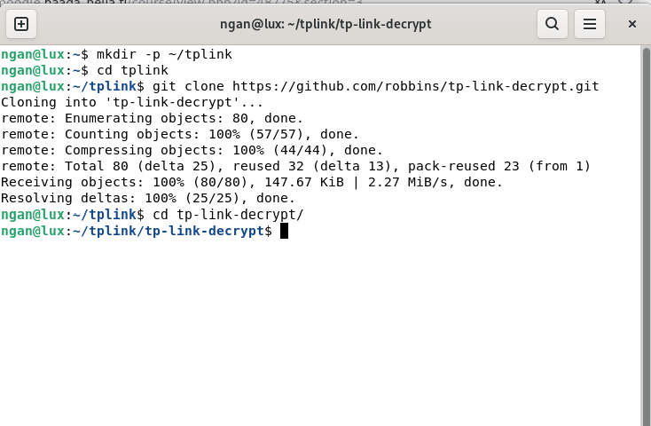

2. Ladataan samaan kansioon v4-päivitystiedosto
`aws s3 cp s3://download.tplinkcloud.com/firmware/Tapo_C200v3_en_1.4.2_Build_250313_Rel.40499n_up_boot-signed_1747894968535.bin Tapo_C200v4_en_1.4.2.bin --no-sign-request`

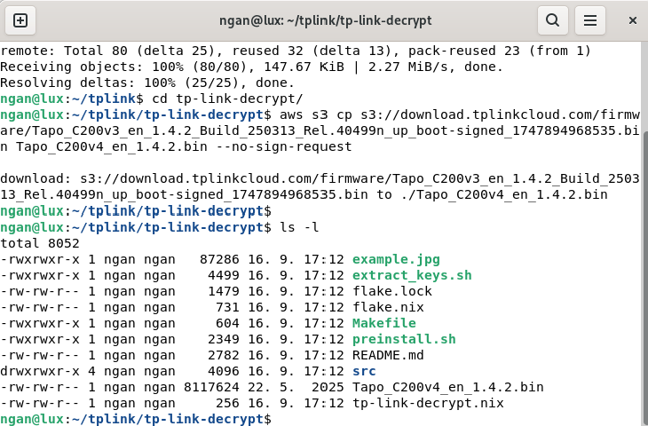

3. Ladataan myös v3-muistivedos Moodlesta virtuaalikoneen Downloads-kansioon

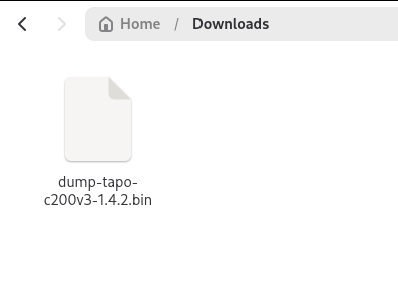

4. Käännetään purkutyökalu ajamalla seuraavat komennot
- `./preinstall.sh`
- `./extract_keys.sh`
- Emme valitse quit modea, jotta saadaan kaikki ilmoitukset esille
- `make`

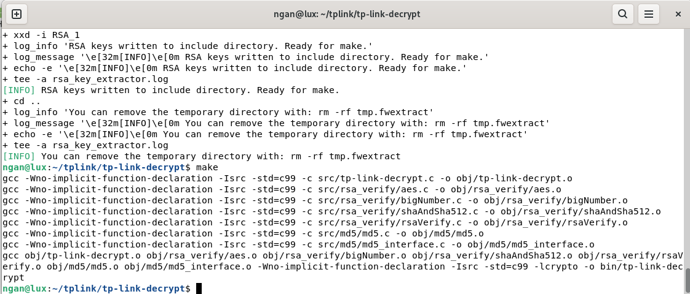

5. Puretaan AWS-tiedoston salaus
`./bin/tp-link-decrypt Tapo_C200v4_en_1.4.2.bin`

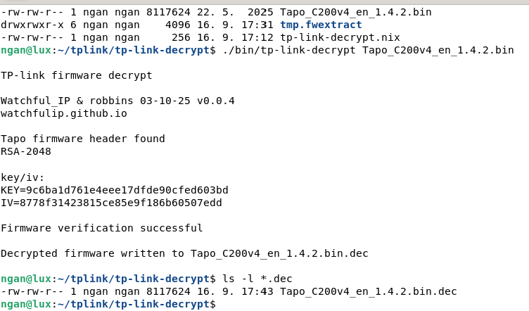

6. Käytetään binwalkia analysoimaan kuvatiedosto
- `binwalk Tapo_C200v4_en_1.4.2.bin.dec`
Puretaan vielä omaksi kansioksi
- `binwalk -e Tapo_C200v4_en_1.4.2.bin.dec`
Varmistetaan, että kansio ilmestyi
- `ls -l _Tapo_C200v4_en_1.4.2.bin.dec.extracted`

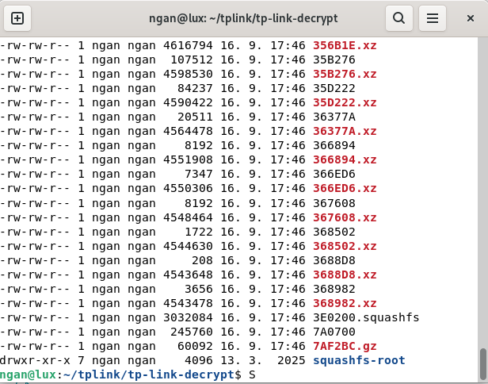

7. Puretaan myös vanha v3-dump Downloads-kansiosta
`binwalk -e ~/Downloads/dump-tapo-c200v3-1.4.2.bin`

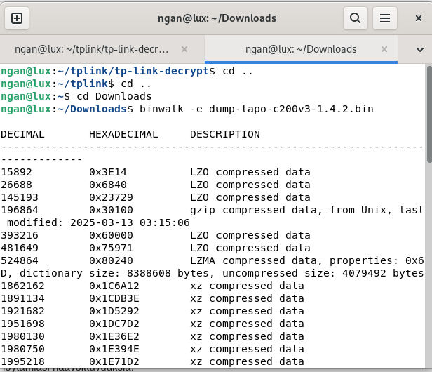

Tarkistetaan lopuksi `ls -l`

8. Siirrytään purettuun kansioon
`cd _Tapo_C200v4_en_1.4.2.bin.dec.extracted/squashfs-root`
Tarkistetaan kansiorakenne
- `ls -la`
- `ls -la usr/bin/`
- `ls -la etc/shadow`
- `ls -la etc/passwd`

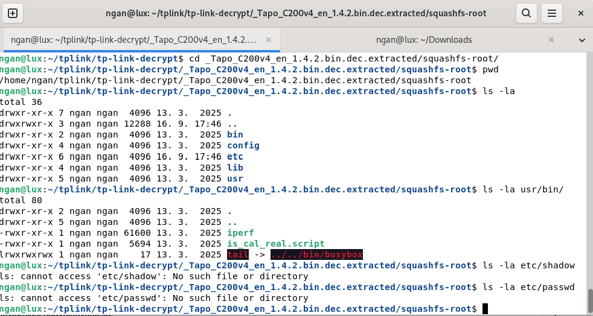

Huomaamme, että TP-Linkn uudessa v4-versiossa ei ole passwd tai shadow tiedostoja.

9. Etsitään salasana uudelleen v4
`grep -rn "gen_root_passwd" bin/ sbin/ usr/bin/ usr/sbin/ lib/`

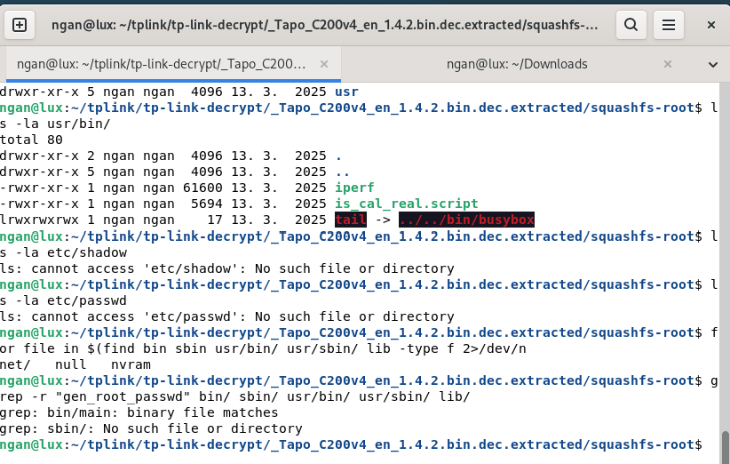

Uusi kamera ei enää tallenna salasanoja perinteiseen etc/shadow -tiedostoon. Sen sijaan aina kun kamera käynnistyy, se suorittaa tuon bin/main -ohjelman, joka sisältää koodinpätkän gen_root_passwd. Tämä koodi laskee salasanan lennosta (esimerkiksi kameran MAC-osoitteen perusteella). Sanakirjahyökkäykset eivät siis enää toimi.

10. Etsitään salasana vanhasta versiosta v3-dump
`grep -rn "gen_root_passwd" bin/ sbin/ usr/bin/ usr/sbin/ lib/`

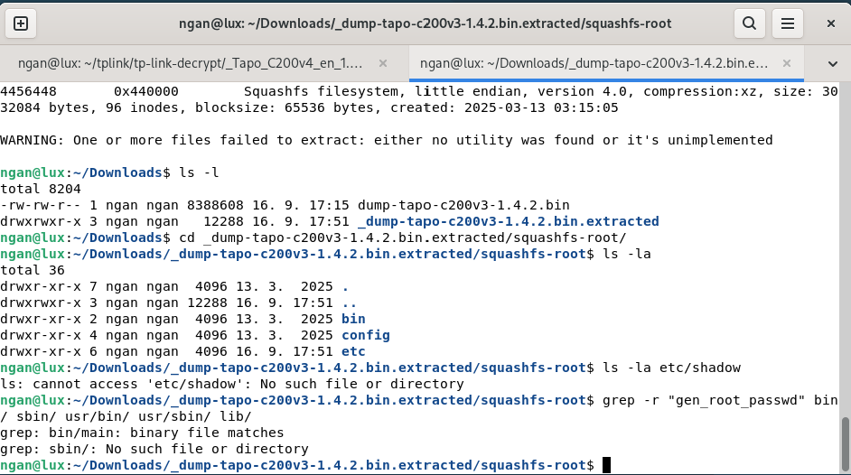

Siitä ei myöskään löydy etc/shadow tiedostoa

11. Etsitään salasana uudelleen v3
`cd bin`
`strings main | grep -iE "passwd|root|gen"`

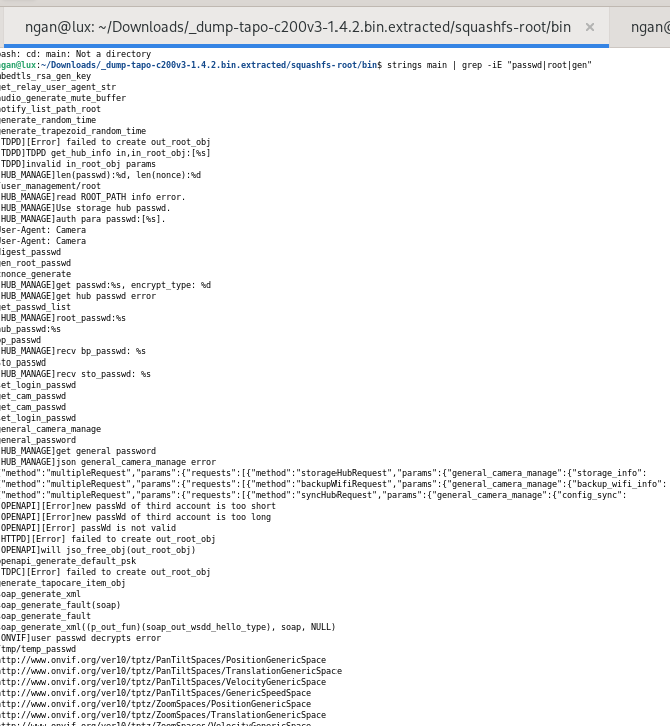
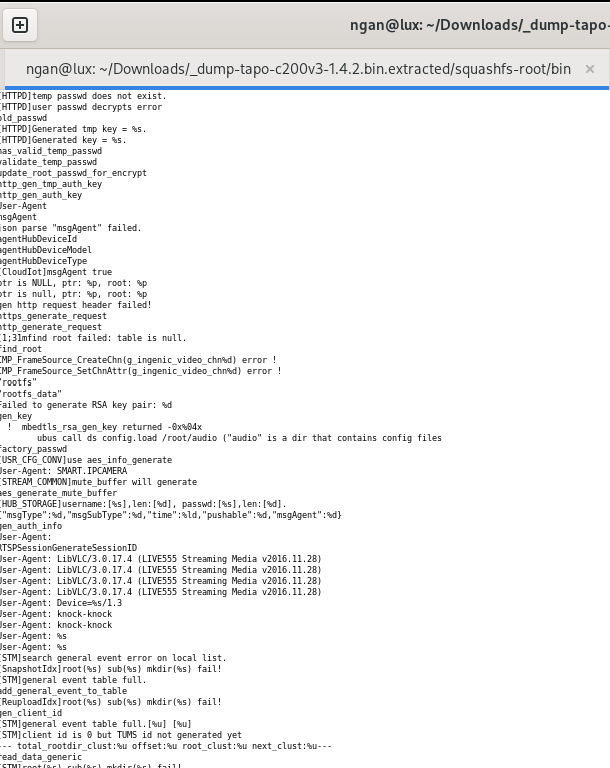

Huomaamme kuvista, että koodi ei hae käyttäjätietoja kiinteästä etc/shadow-tiedostosta.

Tulosteet viittaavat siihen, että binääritiedosto (bin/main) käsittelee salasanoja dynaamisesti muistissa ja luo tilapäisiä avaimia.
- gen_root_passwd
- [HUB_MANAGE]root_passwd:%s
- [HTTPD]Generated key = %s.
- /tmp/temp_passwd
Havainnot osoittavat, että kamera luo tilapäisiä salasanoja tai laskee tarvittavat valtuutukset lennosta muistiin sen sijaan, että se lukisi niitä staattisesta tiedostosta.

**Johtopäätökset:**
1. Suojaus offline-murroilta: Koska perinteistä etc/shadow-tiedostoa ei ole olemassa, laitteeseen ei voi kohdistaa tyypillisiä offline-tilassa tehtäviä sanakirja- tai tiivisteenmurtamishyökkäyksiä (kuten John the Ripperillä tehtäviä murtoja), vaikka laiteohjelmisto saataisiinkin käsiin. Tämä nostaa perusturvallisuustasoa vanhempiin laitteisiin verrattuna.
2. Dynaaminen logiikka tuo uusia riskejä: Salasanojen generointi binäärien sisällä (bin/main ja siihen liittyvät kirjastot) tarkoittaa sitä, että laitteen todellinen tietoturva riippuu siitä, kuinka vahvasti salasanan generointialgoritmi on suojattu. Jos hyökkääjä kykenee purkamaan koodin logiikan (esim. Ghidralla tai muilla reverse engineering -työkaluilla), hän voi kyetä päättelemään laitteen root-salasanan suoraan sarjanumeron tai MAC-osoitteen perusteella.
3. Laite on suojattu huomattavasti paremmin suorilta tiedostopohjaisilta murroilta kuin perinteiset sulautetut järjestelmät, mutta täydellistä haavoittumattomuutta se ei takaa, sillä binääritasolle piilotettu logiikka on aina purettavissa riittävällä asiantuntemuksella.

Vastauksessa hyödynnetty Gemini Pro ja Flashia

# Open valmiiksi käännetty kansio

1. Erotetaan avaimet
`./extract_keys.sh`
`make`

